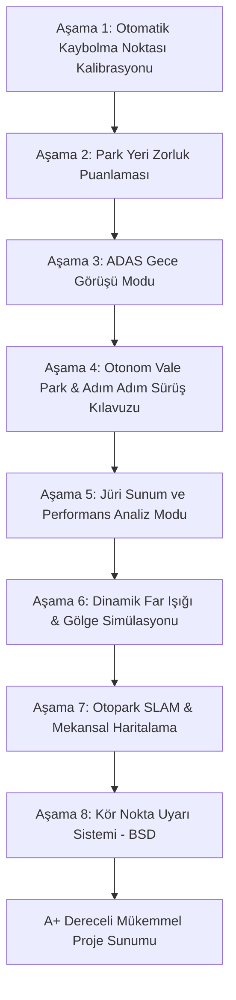

# Akıllı Otopark ve ADAS Bitirme Projesi - Geliştirme Yol Haritası ve Planı

Bu belge, projenin tamamen sürücü odaklı ADAS ve Otonom/Yarı-Otonom Park Asistanı vizyonuna uygun olarak seçilen ve sırasıyla geliştirilecek olan özellikleri listeler. Her bir özellik, hiçbir hata ve eksiklik içermeyecek şekilde, son derece profesyonel ve özenli bir biçimde sırayla kodlanacaktır.

---

## 📅 UYGULAMA SIRASI VE ÖZELLİK LİSTESİ

---

## 🔍 DETAYLI ÖZELLİK TANIMLARI

### 🛠️ AŞAMA 1: Kaybolma Noktası (Vanishing Point) ile Otomatik Kamera Kalibrasyonu
*   **Açıklama**: Görüntüdeki otopark şerit çizgilerini (Hough Line Transform ve filtreleme ile) analiz ederek çizgilerin ufukta birleştiği kaybolma noktasını bulur. Bu geometriden yola çıkarak kuş bakışı (IPM) homografi matrisini otomatik olarak kalibre eder.
*   **Hedeflenen Sonuç**: Kullanıcının elle nokta seçmesine gerek kalmadan en doğru perspektif dönüşümünü otomatik gerçekleştirmek.
*   **Durum**: ✅ Tamamlandı (Görsel Analiz Raporu & Önizleme Diyaloğu entegre edildi)

### 📊 AŞAMA 2: Park Yeri Manevra Zorluk Skoru (Slot Parking Difficulty Index)
*   **Açıklama**: Boş park alanlarının (slot) genişliğini, yanındaki araçların şerit çizgisine olan uzaklıklarını (hizalamasını/taşmasını) ve manevra koridorunun genişliğini analiz eder.
*   **Hedeflenen Sonuç**: Her boş slot için ekranda, 2D şematik haritada ve BEV görünümünde **"KOLAY %XX"**, **"ORTA %XX"** veya **"ZOR %XX (DAR!)"** şeklinde dinamik renk kodlu uyarılar göstermek.
*   **Durum**: ✅ Tamamlandı
    *   *Fiziksel Boyut Analizi*: Boş slotun metrik/piksel genişliği ile aracın genişliği/boyu kıyaslanarak sığma/zorluk temeli belirlendi.
    *   *Komşu Araç Hizalama & Çizgi Taşması*: Yan park etmiş araçların varlığı ve bu araçların boş slot çizgilerini ne kadar ihlal ettiği (encroachment) piksel bazlı hesaplanarak zorluk puanı düşürüldü.
    *   *Manevratik Koridor Genişliği*: Karşı şeritteki araçların veya nesnelerin boş slota dikey yakınlığı (manevra alanı) kontrol edilerek corridor temizliği analiz edildi.
    *   *Görsel Entegrasyon*: Ana kamera akışında, 2D Tesla stili dijital ikiz haritada ve IPM BEV projeksiyonunda Premium BGR (Emerald Green, Amber Orange, Coral Red) renk paletiyle zorluk derecesi ve metrikleri eşzamanlı olarak çizdirildi.

### 🌙 AŞAMA 3: ADAS Gece Görüş Modu (Night-Vision Contrast Enhancement)
*   **Açıklama**: Düşük ışık koşullarında veya gölgeli alanlarda, görüntü üzerinde kontrast iyileştirme (CLAHE - Contrast Limited Adaptive Histogram Equalization) uygulayarak nesne tespit doğruluğunu artırır ve görseli sürücü için aydınlatır.
*   **Hedeflenen Sonuç**: Arayüzde "Gece Görüşü AÇIK" butonu ve split-screen (yarı ekran) aydınlatılmış görüntü.
*   **Durum**: ✅ Tamamlandı
    *   *CLAHE Kontrast İyileştirme*: BGR görüntü LAB renk uzayına dönüştürülerek L (parlaklık) kanalı üzerinde Adaptif Histogram Eşitleme (CLAHE) uygulandı ve tekrar BGR'a dönüştürüldü. Bu işlem kontrastı aşırı bozmadan gece karanlığındaki nesneleri belirginleştirdi.
    *   *Geliştirilmiş Yapay Zeka Tespiti*: Gece görüşü aktif edildiğinde, YOLO araç tespiti, YOLOPv2 yol şerit maskesi segmentasyonu ve otomatik IPM kalibrasyon algoritmaları bu aydınlatılmış görüntü üzerinde çalıştırıldı. Böylece düşük ışıkta araç ve park yeri tespit başarısı artırıldı.
    *   *Premium Bölünmüş Ekran (Split-Screen) Arayüzü*: Kullanıcıya sistemin karanlığı nasıl aydınlattığını göstermek amacıyla sol taraf orijinal karanlık kareyi, sağ taraf ise aydınlatılmış gece görüşü karesini gösterecek şekilde dinamik bölünmüş ekran ve ortadan geçen neon bir sınır çizgisi geliştirildi.
    *   *Hassasiyet Ayarı*: CLAHE kontrast limiti (Clip Limit) kullanıcı tarafından 1.0 ile 8.0 arasında anlık olarak kaydırıcı (slider) vasıtasıyla ayarlanabilir hale getirilerek farklı ışık koşulları için dinamik adaptasyon sağlandı.

### 🚗 AŞAMA 4: Otonom Vale Park (AVP) Simülasyonu & Anlık Sürüş Kılavuzu
*   **Açıklama**: Kullanıcı boş bir park alanına tıkladığında, simüle edilen aracın o slota girebilmesi için gerekli olan direksiyon açılarını ve manevra yörüngesini hesaplar. Araç slota doğru hareket ederken, anlık konumuna göre **yapılması gereken hareketleri adım adım ekranda gösterir**.
*   **Hedeflenen Sonuç**: Kullanıcının 2D şematik harita üzerinde boş bir slota tıklayarak park sürecini (Dik veya Paralel) gerçek zamanlı, animasyonlu, yörünge çizgili ve dönen direksiyon simgesi içeren bir otopilot kokpiti gibi izleyebilmesi.
*   **Durum**: ✅ Tamamlandı
    *   *Tıkla ve Seç Arayüzü*: 2D dijital ikiz şematik harita üzerinde boş slotlara fare tıklama dinleyicisi (`_on_map_clicked`) eklendi. Tıklanan slotun koordinatları şematik haritadaki piksel koordinatları ile eşleştirilerek hedef slot dinamik olarak belirlendi. Dolu slot seçildiğinde kullanıcıya görsel uyarı verildi.
    *   *Yörünge Hesaplama Motoru (Trajectory Generator)*: Seçilen park moduna göre (Dik Park veya Paralel Park) ego aracının başlangıç pozisyonundan hedef slotun içerisine kadar pürüzsüz, matematiksel eğriler (Bezier eğrisi dahil) kullanan çok aşamalı yörünge yolları üretildi.
    *   *Adım Adım Kılavuz ve Telemetri*: Sürüş kılavuz ekranı oluşturularak her bir adım için anlık yapılması gereken eylemler (hizalanma, direksiyon kırma yönü, geri manevra vb.) sürücüye premium bir bildirim kartında gösterildi. Direksiyon açısı ve simüle edilen araç hızı anlık olarak güncellendi.
    *   *Akıcı Animasyon & Dönen Direksiyon Simgesi*: Zamanlayıcı (QTimer) tabanlı 80ms aralıklı simülasyon motoru kuruldu. Araç yörünge üzerinde ilerlerken tekerleklerin yönüne göre direksiyon simgesi 2D haritanın sağ köşesinde dinamik olarak döndürüldü. Rotasyonlu araç gövdesi (`_draw_rotated_car`) ve cam ayrıntıları her adımda yeniden çizdirildi.

### 📊 AŞAMA 5: Jüri Sunum ve Performans Analiz Modu
*   **Açıklama**: Canlı jüri sunumunda performansı kantitatif olarak göstermek için gerçek zamanlı işlemci gecikme analiz paneli ve tek tıkla otopilotu başlatan otomatik demo sistemi.
*   **Hedeflenen Sonuç**: Jüri üyelerinin önünde sistemin çalışma kararlılığını, gecikme metriklerini ve otonom vale park döngüsünü hiçbir aksaklık olmadan sergilemek.
*   **Durum**: ✅ Tamamlandı
    *   *Performans Analiz Paneli*: Arayüzde sağ üst köşeye yerleşen neon kırmızı çerçeveli, yarı şeffaf bir HUD ekranı tasarlandı. Bu ekranda gerçek zamanlı FPS ve toplam gecikme süresi dinamik olarak hesaplanıp gösterildi.
    *   *Gecikme Kırılım Grafikleri (Latency Profiler)*: YOLO tespit süresi, drivable area segmentasyonu, park slotu analiz süresi ve UI çizim gecikmesi ayrı ayrı zamanlanarak hareketli ortalama filtreleriyle HUD üzerine renkli barlar halinde çizdirildi.
    *   *Tek Tıkla Otomatik Demo*: "Otomatik Demoyu Başlat" butonu eklendi. Tıklandığında otoparktaki en uygun (en yüksek kolaylık derecesine sahip) boş slotu otomatik olarak seçip, AVP simülasyonunu başlatır ve ekranı 2D kuş bakışı görünümüne geçirerek sunumu otonom olarak gerçekleştirir.

### 💡 AŞAMA 6: Dinamik Far Işığı & Gölge Simülasyonu (Headlight Shader)
*   **Açıklama**: 2D Dijital İkiz haritada simüle edilen aracın önünden yola doğru uzanan dinamik far ışığı konileri ve bu ışık hüzmelerinin otoparktaki diğer dolu slotlara çarptığında ürettiği 2D gölgeler.
*   **Hedeflenen Sonuç**: Park simülasyonu esnasında direksiyon döndükçe far ışıklarının dönmesi ve haritanın premium bir görsel derinliğe sahip olması.
*   **Durum**: ✅ Tamamlandı
    *   *Fizik Tabanlı 2D Gölge Hacmi (Shadow Volume)*: Araç farlarından çıkan ışığın dolu park alanlarındaki araçlara çarparak arkalarında gerçekçi 2D gölgeler oluşturması için ışık kaynağından engellerin köşelerine doğru uzanan gölge poligonları matematiksel olarak hesaplandı ve maskelendi.
    *   *Yumuşak Işıklandırma Efekti (Soft Shadows)*: Oluşturulan far ışığı ve gölge maskesine Gaussian Blur uygulanarak ışık hüzmesinin ve gölgelerin geçişleri yumuşatıldı.
    *   *Night Vision Entegrasyonu*: Farlar, hem AVP otonom park simülasyonu esnasında direksiyon açısına göre dönerek çalışır, hem de manuel modda Gece Görüşü (Night Vision) aktif edildiğinde otomatik olarak devreye girer.

### 🗺️ AŞAMA 7: Otopark SLAM & Mekansal Haritalama
*   **Açıklama**: Kamera otopark içerisinde ilerledikçe, aracın hareket vektörlerini (ego-motion) ve YOLO/çizgi tespitlerini birleştirerek otoparkın 2D şematik krokisini gerçek zamanlı olarak sıfırdan bellekte oluşturup genişletme.
*   **Hedeflenen Sonuç**: Haritanın başlangıçta boş olması ve araç yol aldıkça yeni slotların haritada belirerek kalıcı hale gelmesi.
*   **Durum**: ✅ Tamamlandı
    *   *Kümülatif Ego-Motion Takibi*: Her kare için `vehicle_tracker.last_ego_motion` (optik akış ile hesaplanan) değerleri `_slam_cum_dx` ve `_slam_cum_dy` birikimli offsetinde toplanarak aracın otopark içindeki toplam hareketi sürekli takip edildi.
    *   *Global Koordinat Dönüşümü ve Slot Eşleme*: Yeni tespit edilen her slot `global_coord = local_coord + offset` formülüyle evrensel koordinat uzayına dönüştürüldü. 55 piksel tolerans mesafesiyle yakın global merkezler eşleştirilerek aynı slot iki kez eklenmeden güncellendi.
    *   *SLAM Modu Arayüzü*: Sol kontrol paneline "SLAM Modu AÇ / KAPAT" ve "Haritayı Sıfırla" butonları içeren Cyan kenarlıklı premium kart eklendi. Sıfırla butonuna basıldığında harita tamamen temizlenerek "boş harita" demo'sunun tekrar canlandırılması sağlandı.

### 🚲 AŞAMA 8: Kör Nokta Uyarı Sistemi (Blind Spot Detection - BSD)
*   **Açıklama**: Park ederken veya geri manevra yaparken, yan/arka kör noktalara giren hızlı hareketli nesneler (YOLO ile tespit edilen yayalar, bisikletliler) için görsel ayna ikazları ve sesli alarmlar tetikleme.
*   **Hedeflenen Sonuç**: Sürücünün göremediği kör noktalarda çarpışma risklerini minimize eden ADAS koruması.
*   **Durum**: ✅ Tamamlandı
    *   *Tehlike Bölgesi Algılama*: Kamera görüntüsünün alt %40'ı "kör bölge" olarak tanımlandı. Bu bölgede sol veya sağ %35'lik şeride giren yaya (cls 0), bisikletçi (cls 1) veya motosikletçi (cls 3) YOLO tespitleri tehdit olarak işaretlendi.
    *   *Yanıp Sönen Ayna İkaz Panelleri*: Tehdit tespit edildiğinde sol ve/veya sağ köşelere yarı şeffaf turuncu-kırmızı "KÖR NOKTA - SOL/SAĞ TARAF" ayna panelleri çizildi; her 2 karede bir yanıp sönen strobe efekti uygulandı.
    *   *Merkezi Uyarı Başlığı & Sesli İkaz*: Ekranın alt orta kısmında "DİKKAT: KÖR NOKTA UYARISI" kırmızı banner çizildi. İlk tehdit anında `QApplication.beep()` ile sesli uyarı tetiklendi.
    *   *BSD Modu Arayüzü*: Sol kontrol paneline turuncu kenarlıklı "BSD Modu AÇ / KAPAT" butonu eklendi. Mod aktifken buton turuncu renkte kalır ve durum çubuğu anlık uyarı metnini gösterir.
