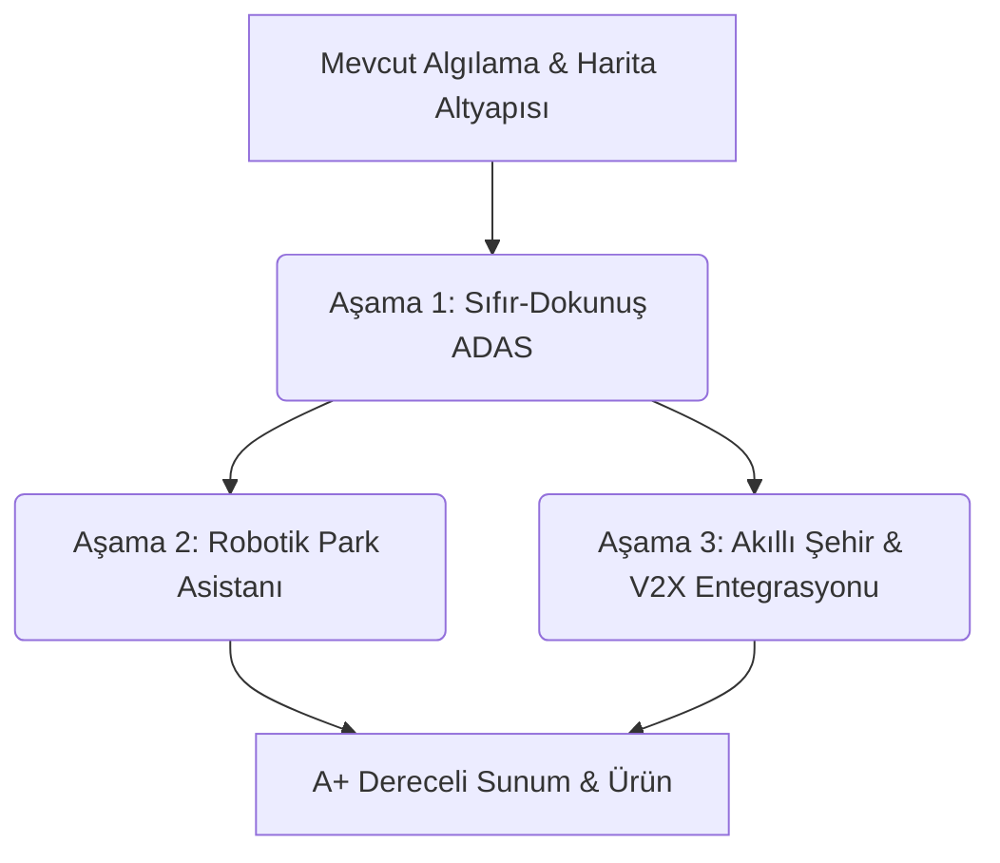

# Akıllı Otopark ve ADAS Bitirme Projesi - Master Yol Haritası ve Fikir Kütüphanesi

Bu belge, projenizin akademik değerini, teknik derinliğini ve jüri karşısındaki ticari/teknolojik sunum kalitesini en üst seviyeye çıkarmak için geliştirilen tüm fikirleri bir araya getiren kalıcı **Master Yol Haritası (Master Project Roadmap)** dokümanıdır.

---

## MÜKEMMEL BİR JÜRİ SUNUMU İÇİN YOL HARİTASI

---

## 1. YENİ NESİL ÇIĞIR AÇICI FİKİRLER (Jüriyi Büyüleyecek Teknolojiler)

Bu özellikler projeyi basit bir "nesne algılama" yazılımından çıkarıp, akıllı şehir teknolojileri ve otomotiv mühendisliği seviyesine ulaştırır:

### 📊 Yapay Zeka Destekli Park Yeri Zorluk ve Kalite Puanlaması (Slot Difficulty Scoring)
*   **Çalışma Mantığı**: Boş bir park yeri algılandığında sistem sadece "BOŞ" demez; o slotun genişliğini, yanındaki araçların hizalamasını (çizgiyi taşıp taşmadıklarını) ve manevra alanını analiz eder.
*   **Görselleştirme**: Her boş slot için bir **"Manevra Zorluk Skoru" (Örn: %88 Kolay, %35 Zor - Dar Alan!)** hesaplar ve şematik harita üzerinde gösterir. Acemi sürücüler için hayat kurtarıcı bir ADAS özelliğidir.

### 📝 Akıllı Park İhlal ve Kanıt Raporlayıcı (Parking Violation Evidence Generator)
*   **Çalışma Mantığı**: Sistem, iki otopark slotunu birden işgal eden (çizgi ihlali yapan) veya otopark koridorunu/engelli yerini izinsiz kapatan araçları otomatik olarak algılar.
*   **Kanıt Kaydı**: İhlal tespit edildiğinde, aracın plakasını okur, ihlal anının fotoğrafını çeker ve otoparkın şematik haritasındaki konumunu işaretleyerek otomatik bir **PDF İhlal Raporu (Violation Ticket)** oluşturur. 
*   **Jüriye Etkisi**: Projenin belediyeler ve ticari otoparklar için doğrudan ticarileştirilebilir bir ürün olduğunu gösterir.

### 🌐 V2X (Vehicle-to-Everything) Web Arayüzü ve Canlı Yayın API'si
*   **Çalışma Mantığı**: Masaüstü uygulamasının ürettiği 2D şematik otopark haritasını ve doluluk verilerini yerel bir web sunucusuna (FastAPI/Websockets) gerçek zamanlı olarak yayınlaması.
*   **Akıllı Şehir Entegrasyonu**: Sürücüler veya otopark yöneticisi, herhangi bir web tarayıcısından (örneğin telefonlarından) otoparkın doluluk durumunu ve boş yerleri canlı olarak interaktif bir web haritası üzerinden izleyebilir.

### 🗺️ Otopark SLAM ve Mekansal Haritalama (Parking Lot Mapping)
*   **Çalışma Mantığı**: Sürücü otoparka girdiğinde, uygulama kamera görüntülerini ve optik akış hareket vektörlerini kullanarak otoparkın yerleşim planını sıfırdan haritalandırır (SLAM).
*   **Akademik Değeri**: Araç ilerledikçe yeni slotlar haritaya eklenir ve otoparkın eksiksiz bir kuş bakışı krokisi bellekte biriktirilir. Sürücü aynı otoparka tekrar geldiğinde bu harita yüklenir.

### 🔄 Sanal Geri Görüş Kamerası ve 360° Çevre Görüşü Emülasyonu (Virtual Surround View)
*   **Çalışma Mantığı**: Tek bir ön cam kamerası olmasına rağmen, araç geri vitese takıp hareket ettiğinde, otopark zeminini aracın arkasına doğru bükerek (Inverse Perspective Mapping) **sanal bir geri görüş kamerası** simüle etmek.
*   **Etkisi**: Sürücü geri gittikçe, otopark zeminini aracın altında kayarak akar. Bu, Tesla ve premium araçlardaki 360-surround view sisteminin tek bir kamerayla (yazılımsal olarak) emüle edilmesidir.

### ⏱️ Yapay Zeka Destekli Doluluk Tahmini ve Zaman Serisi Analizi (Predictive Occupancy Heatmap)
*   **Çalışma Mantığı**: Otopark doluluk verilerini gün boyu veri tabanına kaydederek, otoparkın günün hangi saatlerinde ne kadar dolu olacağını tahmin eden bir **zaman serisi tahmin modeli (Predictive Analytics)** entegrasyonu.
*   **Görselleştirme**: Arayüzde "Saat 14:00'te Tahmini Doluluk: %85" veya "Doluluk Isı Haritası (Hourly Occupancy Heatmap)" gibi analitik öngörüler göstermek.

### ⚠️ Acil Durum Frenleme ve Yaya Çarpışma Önleyici (Autonomous Emergency Braking - AEB)
*   **Çalışma Mantığı**: Sürücü park ederken veya yavaş sürerken, aracın önüne veya arkasına aniden çıkan engeller/yayalar (YOLO ile algılanan) ile aracın manevra çizgisi kesiştiğinde:
    - Arayüzde devasa bir yanıp sönen kırmızı **"BRAKE / FREN YAPIN"** uyarısı tetiklenmesi,
    - Sesli alarm çalması,
    - Aracın simülatörde otonom olarak acil durdurulması.

### 🌿 Karbon Ayak İzi ve Zaman Tasarrufu Hesaplayıcı (Green Parking Eco-Optimizer)
*   **Çalışma Mantığı**: Sürücünün en yakın boş park yerini ararken kaybettiği zamanı, yakıt tüketimini ve çevreye saldığı CO2 emisyonunu hesaplayan ekolojik analitik paneli.
*   **Puan Etkisi**: Projenin boş yeri doğrudan göstermesi sayesinde sürücünün **kaç dakika zaman kazandığını, kaç litre yakıt tasarrufu yaptığını ve kaç gram CO2 emisyonunu engellediğini** gösteren sürdürülebilirlik raporu. Jürilerin "yeşil enerji" ve "sürdürülebilirlik" konularına verdiği büyük önem göz önüne alındığında bu özellik notu tavan yaptıracaktır.

### 🌧️ Yapay Zeka Tabanlı Hava Durumu ve Zemin Kayganlık Tahmini (Road Friction Estimation)
*   **Çalışma Mantığı**: Yağmurlu, karlı veya çamurlu zemin koşullarını görüntü işlemeyle analiz ederek fren güvenliği mesafesini dinamik olarak artırma.
*   **ADAS Entegrasyonu**: "Zemin: Islak / Kaygan" uyarısı basılır ve park asistanının önerdiği maksimum manevra hızı otomatik olarak düşürülür (Maks 5 km/s).

### 💡 Dinamik Farlar ve Gölge Simülasyonu (Dynamic Headlight & Shadow Shader)
*   **Çalışma Mantığı**: Otopark karanlık olduğunda veya gece modunda, şematik haritadaki "ARACIMIZ" silüetinin önüne direksiyon açısına göre sağa/sola dönen iki adet **sanal ışık hüzmesi (headlight cones)** çizmek.
*   **Görsel Etki**: Işık hüzmesi otoparktaki diğer araçlara çarptığında gölgeler üretir. Jürinin sunum ekranına kilitlenmesini sağlayacak çok şık bir UI/UX dokunuşudur.

### ♿ Plaka Tabanlı Engelli / VIP Rezerve Park Yönetimi (VIP & Electric Charging Spots)
*   **Çalışma Mantığı**: Girişte plaka tanıma ile VIP, Engelli veya Elektrikli Şarj slotu rezerve etmiş araçları tanıyarak sesli ve görsel olarak kendi rezerve slotuna giden özel rotayı çizmek: *"Sayın Oguzhan, elektrikli araç şarj alanınız olan SLOT 3'e yönlendiriliyorsunuz."*
*   **İhlal Alarmları**: Yetkisiz bir plaka bu özel slotlara park ettiğinde güvenlik arayüzünde "Rezerve Slot İhlali" kırmızı alarmı yanıp söner.

### 🥱 Sürücü Yorgunluk ve Dikkat Analiz Modülü (Driver Drowsiness Integration)
*   **Çalışma Mantığı**: Bilgisayarın web kamerası aktif edilirse (veya video ile simüle edilirse), sürücünün gözlerini/yüzünü (MediaPipe/Dlib ile) takip ederek göz kapama sıklığından yorgunluk ve uykusuzluk tespiti.
*   **ADAS Uyarısı**: Gözü uzun süre yoldan ayrıldığında arayüzde büyük kırmızı **"DİKKAT: YOLA ODAKLANIN"** uyarısı verilmesi ve bip sesi çalınması.

### 🔀 Güvenlik Öncelikli Park Modu Danışmanı (Safety-First Parking Advisor)
*   **Çalışma Mantığı**: Sistem paralel ve dik park seçeneklerini karşılaştırır. Trafik yoğunluğu, slotun etrafındaki araçların çizgileri ne kadar taşırdığı ve yol genişliğini analiz ederek sürücüye tavsiyede bulunur: *"Tavsiye Edilen: Dik Park (Arkada trafik yoğunluğu yüksek, paralel park kaza riski fazla)."*
*   **Akademik Katkı**: Karar Destek Sistemleri (Decision Support Systems) alanında tez çalışmanıza harika bir teorik katkı sunar.

### 🚲 Araç Kör Nokta Uyarı Sistemi (Blind Spot Detection - BSD)
*   **Çalışma Mantığı**: Sürüş ve park manevrası esnasında, kameranın yan/arka görüş açılarından yaklaşan hızlı nesneleri (motosiklet, bisiklet, koşan yaya) tespit etme.
*   **ADAS İkazı**: Sürücü şerit değiştirmek veya park yerinden çıkmak üzere direksiyon kırdığı an, arayüzde yanıp sönen sarı/kırmızı **"KÖR NOKTA UYARISI"** ikonu gösterilmesi ve sesli ikaz tetiklenmesi.

### 🗺️ Otopark İçi Akıllı Rota Rehberliği ve Yol Bulma (Indoor Dijkstra/A* Navigation)
*   **Çalışma Mantığı**: Otopark haritası çıkarıldıktan sonra, sadece "en yakın slot" yönü göstermekle kalmayıp, otopark koridorları içerisindeki dönüş yönlerini ve tek yön tabelalarını da hesaba katarak en uygun park yerine giden **A* (A-Star) veya Dijkstra tabanlı tüm navigasyon rotasını** şematik harita üzerinde çizmek.
*   **Faydası**: Sürücüyü otopark içindeki ters yönlere girmekten ve çıkmaz sokaklara girmekten korur.

### 🚶 Yaya Geçidi ve Yaya Öncelikli Bölge Akıllı Koruyucu (Pedestrian Crossing ADAS Guard)
*   **Çalışma Mantığı**: Sürüş ve otopark içi manevra sırasında, yol üzerindeki yaya geçidi çizgilerini görüntü işlemeyle tespit etme. Yaya geçidine yaklaşılırken geçitte yaya algılandığında sürücüye *"Yaya Önceliği Bölgesi - Yavaşlayın"* sesli ve görsel uyarısı tetiklenmesi.
*   **Akademik Katkı**: Yaya güvenliği odaklı modern ADAS standartlarının projeye kazandırılması jürinin takdirini alacaktır.

### 📐 Park Yeri Eğim ve Kaldırım Yükseklik Analizörü (Slope & Curb Height Sensor)
*   **Çalışma Mantığı**: Perspektif geometrisi ve yatay çizgiler kullanılarak park yerinin eğimini (yokuş yukarı/aşağı) ve kaldırım yüksekliğini analiz etme.
*   **Faydası**: Sürücüyü park ederken uyarır: *"Kaldırım Yüksekliği 15cm - Alt Sürtme Riski!"* veya *"Eğim %8 - El Frenini Çekin!"* (Fiziksel araç koruma).

---

## 2. "SIFIR-DOKUNUŞ" SÜRÜCÜ ASİSTANI FİKİRLERİ (Hocanın Eleştirisine Cevap)

Sürücünün direksiyon başındayken uygulamaya manuel müdahale etmesini sıfırlayan akıllı otomasyon katmanı:

*   **Dinamik Durumsal Mod Değiştirici (Context-Aware Mode Switching)**:
    - Hız > 30 km/s ise: Sadece şerit ve takip mesafesi uyarısı (Driving Mode).
    - Hız < 20 km/s ise: Ekranın yanında 2D şematik harita otomatik açılır (Search Mode).
    - Geri hareket algılanırsa: Tam ekran otonom park asistanı ve kılavuz oku açılır (Parking Mode).
*   **Çevrimdışı Sesli Komut Modülü (Offline Voice Command)**:
    - İnternet gerektirmeden çalışan yerel bir kütüphane yardımıyla, sürücünün sesli komutlarla ("Hey Park, en yakın yeri bul") arayüzü yönetmesi.
*   **Yok Oluş Noktası ile Otomatik Kamera Kalibrasyonu (Auto-Calibration via Vanishing Point)**:
    - Şeritlerin ufukta birleştiği noktayı tespit ederek kameranın eğim açısını bulup, kuş bakışı homografi (IPM) matrisini manuel müdahale olmadan otomatik kalibre etme.

---

## 3. ROBOTİK PARK YÖRÜNGE PLANLAMA FİKİRLERİ (Autopilot Simülatörü)

*   **Reeds-Shepp & Ackermann Kinematik Yörünge Çözücü**: Aracın fiziksel dönüş yarıçapına uygun, geri manevralı "S" tipi veya tek hamlelik park rotasını dinamik yaylar halinde çizme.
*   **Adım Adım Kokpit Yönlendirme Paneli**: Direksiyonu ne tarafa kırması gerektiğini ve kaç metre gitmesi gerektiğini gösteren adım adım sürüş kılavuzu.
*   **Ego-Motion Compensated Harita**: Sürücü geri giderken kameranın görüş alanından çıkan araçları ve slotları hafızada tutarak haritadan silinmesini engelleyen mekansal bellek.

---

## 4. JÜRİ SUNUM GÜNÜ (DEFENSE) STRATEJİLERİ
1.  **Senaryolu Simülasyon Modu (Presentation Sandbox)**: Sunum esnasında araba olamayacağı için, "Gündüz", "Gece", "Dar Alan" gibi senaryoları tek tıkla koşturup jüriye tüm sistemin otonom çalışmasını izletmek.
2.  **3D LiDAR Tipi Yakınlık Radarı**: Ekranın köşesinde, engelleri mesafe çizgileriyle gösteren retro-modern radar ekranı.
3.  **Performans Analiz Grafik Paneli**: Çıkarım süreleri, CPU/GPU kullanımı ve FPS değerlerini gösteren canlı sistem sağlığı grafikleri.
